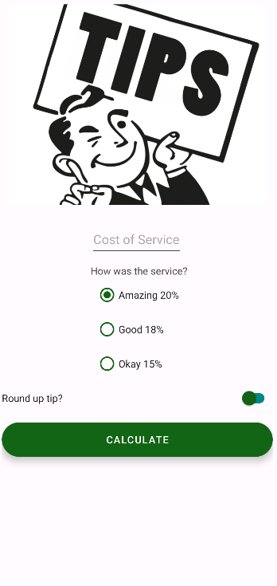
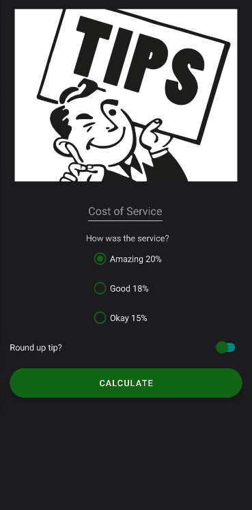

<h1 align="center">Tip Time💰</a> 
<h3 align="center"> Choose lelvel of service, enter cost of the servis and press "Calculate" button if you want to see how much tips do you need to give to the waiter </h3>
<h3 align="center"> If you want to round up tips, turn on switch</h3>
  
<h1 align="center"></a>
<h4 align="center"> This app "Dice Roller" with a minimum API level of 19 ✔️</h1>
<h1 align="center"></a>
<h4 align="center"> Screenshots of the Application below ⬇️ </h4>
<h4 align="center">  </h4>
